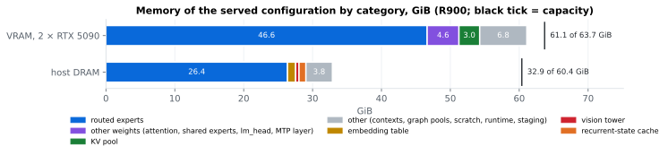

# GLM-5.3-Flash on 2× RTX 5090

[GLM-5.3-Flash][model] by [zai-org][zai] served by [TabbyAPI][tabby] on [ExLlamaV3][exl3] from one desktop box.

**Goal**: serve coding agents, one to four sessions at once, with long prompts that grow with every tool call. Single-stream decode comes first because an agent waits on its own stream; the 4-stream sum, prefill and tool-call correctness follow.

- **Model**: 321 B parameters, about 18 B active per token; [turboderp][turboderp]'s [2.05 bpw EXL3 quantisation][ckpt], 76 GB.
- **Box**: two RTX 5090 (64 GB of VRAM) and 64 GB of DDR5 ([Hardware](#hardware)).
- **Offload**: the checkpoint does not fit the VRAM, so 104 of the 288 routed experts of every MoE layer run on the CPU ([ExLlamaV3's CPU MoE offload][exl3]).
- **Swaps**: the experts the traffic uses most move onto the GPUs while it runs.
- **Draft**: the model's MTP head drafts one token per step while one request is active; with two to four active requests every stream decodes without a draft.
- **Exact output**: no expert is skipped; every drafted token is verified by the full model.
- **Patches written here**: four overlays. [`docker/cheapswap-r3/`](docker/cheapswap-r3/) patches ExLlamaV3 for the expert swaps; [`docker/glm-agent-r2/`](docker/glm-agent-r2/) patches TabbyAPI for GLM tool calls in agent harnesses (streamed arguments, tool-call parsing fixes, reasoning-history recovery, keepalive); [`docker/mtp-fast-r1/`](docker/mtp-fast-r1/) runs the MTP head's CPU experts on the trunk's CPU worker; [`docker/mtp-overhead-r2/`](docker/mtp-overhead-r2/) adds the one-request draft cap and four host-side MTP step changes.
- **Base image**: the served image of [qwen3.8-flash-next-2x-rtx5090][fn], ExLlamaV3 `dev` `5783a93` with that repository's 19 patch sets and TabbyAPI `53da7919`. The launcher clears that image's `EXL3_*` selectors and passes only the GLM offload, swap and MTP settings ([`scripts/FLAG-DECISIONS.txt`](scripts/FLAG-DECISIONS.txt)).
- **Window and KV pool**: 262,144 tokens per request; one 8-bit KV page pool of 262,144 tokens shared by up to 4 concurrent requests, about 2.3 GB (864 bytes per token on each of the 11 attention layers; the other 31 layers keep a fixed-size recurrent state). Vision on, with the vision tower's linear weights in pinned host RAM.

How it got here: [`docs/HISTORY.md`](docs/HISTORY.md). Credits: [`THIRD_PARTY.md`](THIRD_PARTY.md).

[model]: https://huggingface.co/zai-org/GLM-5.3-Flash
[zai]: https://huggingface.co/zai-org
[tabby]: https://github.com/theroyallab/tabbyAPI
[exl3]: https://github.com/turboderp-org/exllamav3
[turboderp]: https://huggingface.co/turboderp
[ckpt]: https://huggingface.co/turboderp/GLM-5.3-Flash-exl3
[fn]: https://github.com/adrienbrault/qwen3.8-flash-next-2x-rtx5090

## Speed

Measured 2026-10-08 on the served configuration ([R914](bench/results/r914-glm53-promote-combo.md), arm CF). Every stream is a chat request forced to 1,024 tokens (html 2,048), temperature 0. In the concurrency figures each stream gets a different prompt (code, prose, chat, html); at 2 and 4 streams no token is drafted.


<details><summary>The same numbers as tables</summary>

| | 1 stream | 2 streams | 4 streams |
|---|---|---|---|
| decode, per stream | 65.3 tok/s | 37.7 tok/s | 21.9 tok/s |
| decode, sum of the streams | 65.3 tok/s | 75.5 tok/s | 87.7 tok/s |
| time to the first token (median per round) | 0.45 to 0.47 s | 0.76 to 0.81 s | 1.70 to 1.73 s |

| code | prose | chat | html | edit |
|---|---|---|---|---|
| 59.5 tok/s | 70.3 tok/s | 69.8 tok/s | 66.1 tok/s | 55.5 tok/s |

</details>

- Single stream, server side: 15.69 ms per token, 27.56 ms per MTP step at 1.756 tokens per step (`scripts/mtp_steps.py`); draft acceptance 0.62 to 0.95 per run, highest on edits and code.
- Spread: two arms of the same session without the four host-side MTP flags measured c1 scores of 65.4 and 64.2 and 4-stream sums of 83.5 and 88.6 tok/s.
- Prefill has not been measured on this configuration; the last cold-prefill figures (previous configuration, 2026-10-07) are in [`docs/HISTORY.md`](docs/HISTORY.md).

Method and run-to-run spread: [`bench/RESULTS.md`](bench/RESULTS.md). The charts are drawn from the raw records by [`bench/plot.py`](bench/plot.py) (`uv run bench/plot.py`).

## Memory

Measured 2026-10-08 on the served configuration, idle after warmup ([R900](bench/results/r900-glm53-memory-layout.md)). Weights come from the checkpoint's tensor sizes and the served config; the VRAM total comes from `nvidia-smi` and the host total from the container's memory cgroup (anonymous plus shared memory, without the page cache); "other" is the measured total minus the listed items.



## What is served

The whole configuration is one line, [`scripts/glm-daily.env`](scripts/glm-daily.env), installed on the box by [`scripts/install-glm-daily.sh`](scripts/install-glm-daily.sh).

- Image `tabbyapi:cheapswap-r3-agent-r2_mtpfast1_overhead-r2` on port 8029: [`docker/cheapswap-r3/`](docker/cheapswap-r3/) and [`docker/glm-agent-r2/`](docker/glm-agent-r2/) combined ([`docker/glm-agent-r2-on-cheapswap-r3/`](docker/glm-agent-r2-on-cheapswap-r3/)), then [`docker/mtp-fast-r1/`](docker/mtp-fast-r1/), then [`docker/mtp-overhead-r2/`](docker/mtp-overhead-r2/).
- 104 experts per MoE layer on the CPU (8 threads). Placement starts from [`scripts/split-stats-broad-r869.json`](scripts/split-stats-broad-r869.json) and adapts every 64 decode tokens by swapping hot CPU experts with cold GPU ones.
- MTP draft depth 1 with `MTP_FAST=1` and `EXL3_MTP_MAX_BATCH=1` (drafting only while one request is active), plus `EXL3_DRAFT_PINNED_STAGING`, `EXL3_MTP_GPU_DRAFT`, `EXL3_MTP_GREEDY_ACCEPT` (greedy requests only) and `EXL3_MTP_CACHED_REWIND`.
- `VISION_OFFLOAD=1`: the vision tower's linear weights in pinned host RAM. 262,144-token cache at 8-bit K and V, up to 4 concurrent requests.
- Agent overlay r2 (`AGENT=1`) and the keep-thinking chat template (`KEEP_THINKING=1`); a missing `reasoning_effort` means `high`; tool calls in TabbyAPI's `glm4_5` format.

## Run it

```sh
PACK=A OFFLOAD_MODE=split CACHE_TOKENS=262144 MAX_SEQ=262144 CACHE_MODE=8,8 GPU_SPLIT=31,31 CHUNK=2048 MAX_BATCH=4 SYSMEM_RC_MB=1024 \
OFFLOAD_N=104 DRAFT=1 DRAFT_N=1 MTP_FAST=1 VISION_OFFLOAD=1 \
GLM_IMG=tabbyapi:cheapswap-r3-agent-r2_mtpfast1_overhead-r2 PINNED_ARENA=1 AGENT=1 KEEP_THINKING=1 \
EXL3_EXTRA='EXL3_MTP_MAX_BATCH=1;EXL3_DRAFT_PINNED_STAGING=1;EXL3_MTP_GPU_DRAFT=1;EXL3_MTP_GREEDY_ACCEPT=1;EXL3_MTP_CACHED_REWIND=1' \
SWAP_MODE=exchange SWAP_POLICY=histogram SWAP_INIT_STATS=$PWD/scripts/split-stats-broad-r869.json \
SWAP_CADENCE=exact SWAP_INTERVAL=64 SWAP_MAX=64 SWAP_SCOPE=global SWAP_FLOOR=4 SWAP_HYST=2.0 \
bash scripts/launch-glm53.sh
```

The first line is the base settings every round uses ([`scripts/glm_arms.sh`](scripts/glm_arms.sh)); the rest is [`scripts/glm-daily.env`](scripts/glm-daily.env). [`scripts/launch-glm53.sh`](scripts/launch-glm53.sh) writes the TabbyAPI config, removes the image's own `EXL3_*` variables, passes the `EXL3_EXTRA` flags to overlay images only, checks that the offload registered and starts the container. It expects the box's paths (`/srv/qwen5090/models/<pack>` on NVMe, falling back to `/storage/data/models/<pack>`; `/srv/qwen5090/`); [`scripts/FLAG-DECISIONS.txt`](scripts/FLAG-DECISIONS.txt) gives the reason for each engine flag.

## Notes

- Agent sessions: the keep-thinking template ([`scripts/templates/glm53-keep-thinking.jinja`](scripts/templates/glm53-keep-thinking.jinja)) is the model's template with `clear_thinking` defaulting to false, so earlier reasoning stays in the prompt and a new user message does not invalidate the prefix cache ([`docs/GOTCHAS.md`](docs/GOTCHAS.md)). In R885c a follow-up agent request reused 7,680 of its 9,915 prompt tokens from the cache with it, and 0 with the model's own template. `KEEP_THINKING=0` restores the model's template.
- Tool calls were last checked on overlay r2 in R882c (4 of 4 streamed `write_file` calls) and R885c (simple tool calls); R914 checked vision (4 of 4) and short answers, not tool calls. Strict tool-call cases with literal GLM tags in the arguments fail on overlay r2; candidates r4 to r4c are in [`docker/`](docker/), and r4c returned 16 of 16 of them as valid calls in R885 ([`bench/RESULTS.md`](bench/RESULTS.md)).
- Greedy output is not reproducible from one run to the next, even within one process ([`docs/GOTCHAS.md`](docs/GOTCHAS.md)).
- The first requests after a boot decode slower until the placement has adapted to the traffic (R870, R872).
- The chat template always opens a `<think>` block; `reasoning_effort` (`low`, `high`, `max`) is its only reasoning control. Both served templates default a missing or unknown value to `high`; the model's own template defaults to `max`, which in our runs often reasoned until the length limit. An explicit `max` is kept.
- How the configuration got here: [`docs/HISTORY.md`](docs/HISTORY.md). What is being tried next: [`docs/PLAN.md`](docs/PLAN.md). Traps: [`docs/GOTCHAS.md`](docs/GOTCHAS.md).

## Hardware

- Two NVIDIA RTX 5090 (32 GB each), each on PCIe 5.0 ×8; layer split 31 + 31 GiB; stock power limits 600 and 575 W, memory clock offset +4,500 MHz, core offset 0.
- AMD Ryzen 7 9800X3D (8 cores, one CCD, 96 MB L3); the CPU expert worker reads cold experts at about 61 GB/s of a 63 GB/s read ceiling (R874).
- 60 GB usable of 2 × 32 GB dual-channel DDR5-6000.

## More

- `bench/RESULTS.md` indexes every round, newest first, with the shared method; `bench/results/` holds one write-up per round and the raw records.
- `docs/HISTORY.md` lists how the served configuration got here, from R858's 49.5 tok/s (MTP on, code-tutorial prompt) and R860's 46.2 (MTP off, four kinds).
- `docs/GOTCHAS.md` lists the traps met on the way.
- `docs/PLAN.md` lists the next levers and the parked ones, each with its source.
- `docker/` holds the overlays; `THIRD_PARTY.md` credits the code and ideas this builds on.
