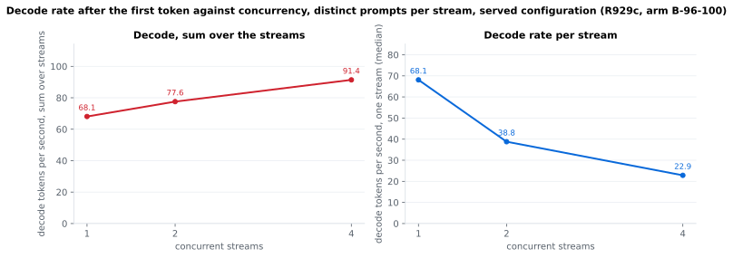
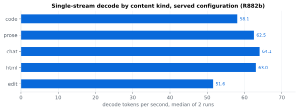
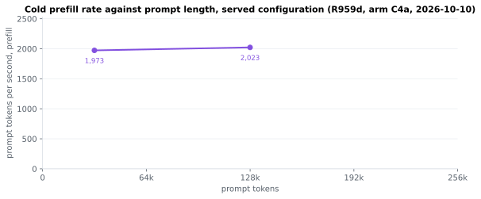

# GLM-5.3-Flash on 2× RTX 5090

[GLM-5.3-Flash][model] by [zai-org][zai] served by [TabbyAPI][tabby] on [ExLlamaV3][exl3] from one desktop box.

**Goal**: serve coding agents, one to four sessions at once, with long prompts that grow with every tool call. Single-stream decode comes first because an agent waits on its own stream; the 4-stream sum, prefill and tool-call correctness follow.

- **Model**: 321 B parameters, about 18 B active per token; [turboderp][turboderp]'s [2.05 bpw EXL3 quantisation][ckpt], 76 GB.
- **Box**: two RTX 5090 (64 GB of VRAM) and 64 GB of DDR5 ([Hardware](#hardware)).
- **Offload**: the checkpoint does not fit the VRAM, so 96 of the 288 routed experts of every MoE layer run on the CPU ([ExLlamaV3's CPU MoE offload][exl3]).
- **Swaps**: the experts the traffic uses most move onto the GPUs while it runs.
- **Exact output**: no expert is skipped.
- **Patches written here**: two overlays. [`docker/cheapswap-r3/`](docker/cheapswap-r3/) patches ExLlamaV3 for the expert swaps; [`docker/glm-agent-r2/`](docker/glm-agent-r2/) patches TabbyAPI for GLM tool calls in agent harnesses (streamed arguments, tool-call parsing fixes, reasoning-history recovery, keepalive).
- **Base image**: the served image of [qwen3.8-flash-next-2x-rtx5090][fn], ExLlamaV3 `dev` `5783a93` with that repository's 19 patch sets and TabbyAPI `53da7919`. The launcher clears that image's `EXL3_*` selectors and passes only the GLM offload and swap settings ([`scripts/FLAG-DECISIONS.txt`](scripts/FLAG-DECISIONS.txt)).
- **Window**: 262,144 tokens, 8-bit KV cache, up to 4 concurrent requests, vision on.

How it got here: [`docs/HISTORY.md`](docs/HISTORY.md). Credits: [`THIRD_PARTY.md`](THIRD_PARTY.md).

[model]: https://huggingface.co/zai-org/GLM-5.3-Flash
[zai]: https://huggingface.co/zai-org
[tabby]: https://github.com/theroyallab/tabbyAPI
[exl3]: https://github.com/turboderp-org/exllamav3
[turboderp]: https://huggingface.co/turboderp
[ckpt]: https://huggingface.co/turboderp/GLM-5.3-Flash-exl3
[fn]: https://github.com/adrienbrault/qwen3.8-flash-next-2x-rtx5090

## Speed

Measured 2026-10-07 on the served configuration ([R882b](bench/results/r882b-glm53-swap-agent.md)). Each stream is a chat request forced to 1,024 tokens, temperature 0.





<details><summary>The same numbers as tables</summary>

| | 1 stream | 2 streams | 4 streams |
|---|---|---|---|
| decode, per stream | 59.9 tok/s | 41.1 tok/s | 27.5 tok/s |
| decode, sum of the streams | 59.9 tok/s | 82.2 tok/s | 109.9 tok/s |

| code | prose | chat | html | edit |
|---|---|---|---|---|
| 58.1 tok/s | 62.5 tok/s | 64.1 tok/s | 63.0 tok/s | 51.6 tok/s |

| prompt, cold, engine-timed | 8,156 tokens | 32,811 tokens |
|---|---|---|
| prefill | 1,999 tok/s | 2,146 tok/s |

</details>



Method, time to the first token and run-to-run spread: [`bench/RESULTS.md`](bench/RESULTS.md). The charts are drawn from the raw records by [`bench/plot.py`](bench/plot.py) (`uv run bench/plot.py`).

## What is served

- Image `tabbyapi:cheapswap-r3-agent-r2` on port 8029: ExLlamaV3 with expert exchange swaps ([`docker/cheapswap-r3/`](docker/cheapswap-r3/)) and TabbyAPI with the GLM agent overlay r2 ([`docker/glm-agent-r2/`](docker/glm-agent-r2/)).
- 96 experts per MoE layer on the CPU (8 threads). Placement starts from [`scripts/split-stats-broad-r869.json`](scripts/split-stats-broad-r869.json) and adapts every 64 decode tokens by swapping hot CPU experts with cold GPU ones.
- MTP draft off ([R883](bench/results/r883-glm53-swap-mtp.md) measured no gain), vision on, 262,144-token cache at 8-bit K and V, up to 4 concurrent requests.

## Run it

```sh
PACK=A OFFLOAD_MODE=split OFFLOAD_N=96 CACHE_TOKENS=262144 MAX_SEQ=262144 CACHE_MODE=8,8 \
GPU_SPLIT=31,31 CHUNK=2048 MAX_BATCH=4 SYSMEM_RC_MB=1024 DRAFT=0 \
GLM_IMG=tabbyapi:cheapswap-r3-agent-r2 PINNED_ARENA=1 AGENT=1 \
SWAP_MODE=exchange SWAP_POLICY=histogram SWAP_INIT_STATS=$PWD/scripts/split-stats-broad-r869.json \
SWAP_CADENCE=exact SWAP_INTERVAL=64 SWAP_MAX=64 SWAP_SCOPE=global SWAP_FLOOR=4 SWAP_HYST=2.0 \
bash scripts/launch-glm53.sh
```

[`scripts/launch-glm53.sh`](scripts/launch-glm53.sh) writes the TabbyAPI config, removes the image's own `EXL3_*` variables, checks that the offload registered and starts the container. It expects the box's paths (`/storage/data/models/<pack>`, `/srv/qwen5090/`); [`scripts/FLAG-DECISIONS.txt`](scripts/FLAG-DECISIONS.txt) gives the reason for each engine flag.

## Notes

- Agent sessions: since 2026-10-08 the launcher serves [`scripts/templates/glm53-keep-thinking.jinja`](scripts/templates/glm53-keep-thinking.jinja) (`KEEP_THINKING=1`, the default), the model's template with `clear_thinking` defaulting to false, so earlier reasoning stays in the prompt and a new user message does not invalidate the prefix cache ([`docs/GOTCHAS.md`](docs/GOTCHAS.md)). R885 measures it; the numbers above were taken with the model's own template, and `KEEP_THINKING=0` restores it.
- R882c re-checked the served image: the 256-pixel vision check and 4 of 4 streamed `write_file` tool calls pass ([R882c](bench/results/r882c-glm53-swap-agent.md)). Strict tool-call cases with literal GLM tags in the arguments fail on overlay r2; candidates r4 to r4c are in [`docker/`](docker/) and R885 tests r4c.
- The first requests after a boot decode slower until the placement has adapted to the traffic (R870, R872). A same-session control in R883 measured 61.1 tok/s single-stream; the mean moves by about 1 to 2 % from boot to boot.
- The chat template always opens a `<think>` block; `reasoning_effort` (`low`, `high`, default `max`) is its only reasoning control. Tool calls use TabbyAPI's `glm4_5` format, which the launcher sets.
- How the configuration got here: [`docs/HISTORY.md`](docs/HISTORY.md). What is being tried next: [`docs/PLAN.md`](docs/PLAN.md). Traps: [`docs/GOTCHAS.md`](docs/GOTCHAS.md).

## Hardware

- Two NVIDIA RTX 5090 (32 GB each), each on PCIe 5.0 ×8; layer split 31 + 31 GiB; stock power limits 600 and 575 W, memory clock offset +4,500 MHz, core offset 0.
- AMD Ryzen 7 9800X3D (8 cores, one CCD, 96 MB L3); the CPU expert worker reads cold experts at about 61 GB/s of a 63 GB/s read ceiling (R874).
- 60 GB usable of 2 × 32 GB dual-channel DDR5-6000.

## More

- `bench/RESULTS.md` indexes every round, newest first, with the shared method; `bench/results/` holds one write-up per round and the raw records.
- `docs/HISTORY.md` lists how the served configuration got here, from R858's 49.5 tok/s (MTP on, code-tutorial prompt) and R860's 46.2 (MTP off, four kinds).
- `docs/GOTCHAS.md` lists the traps met on the way.
- `docs/PLAN.md` lists the next levers and the parked ones, each with its source.
- `docker/` holds the overlays; `THIRD_PARTY.md` credits the code and ideas this builds on.
